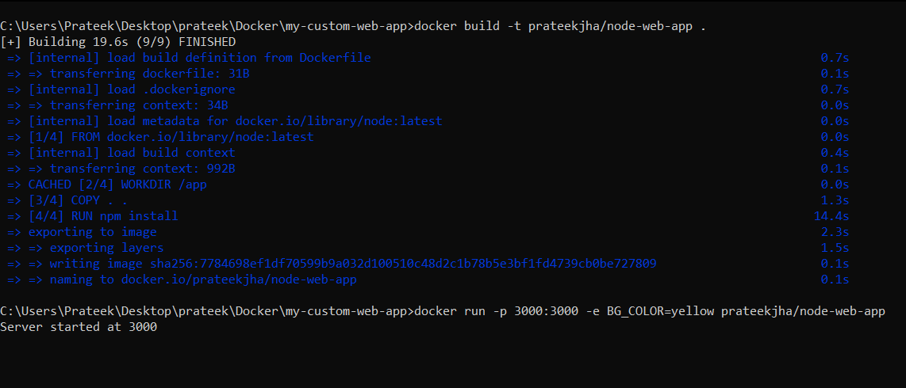
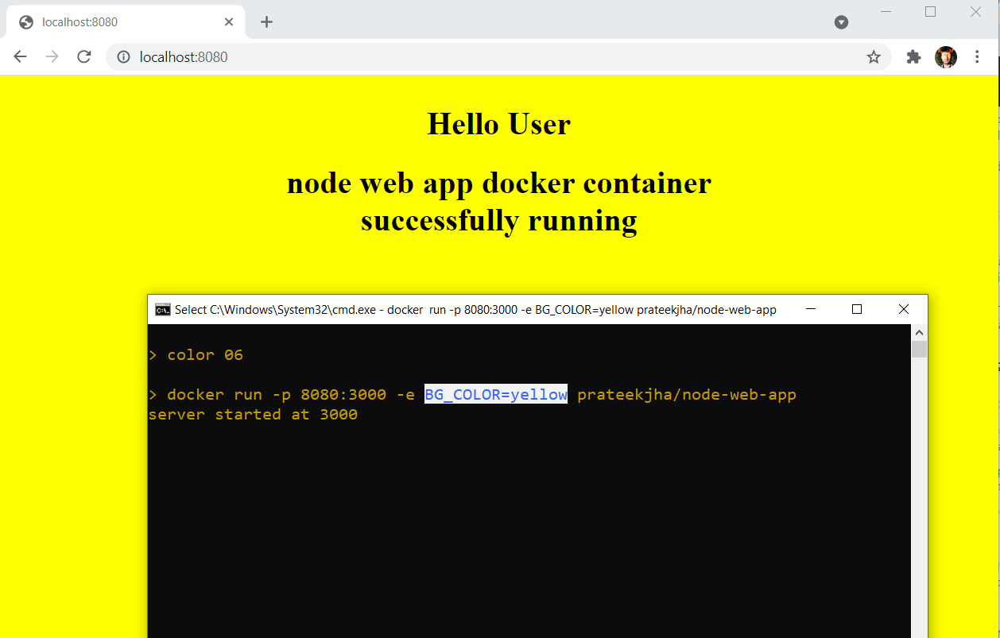
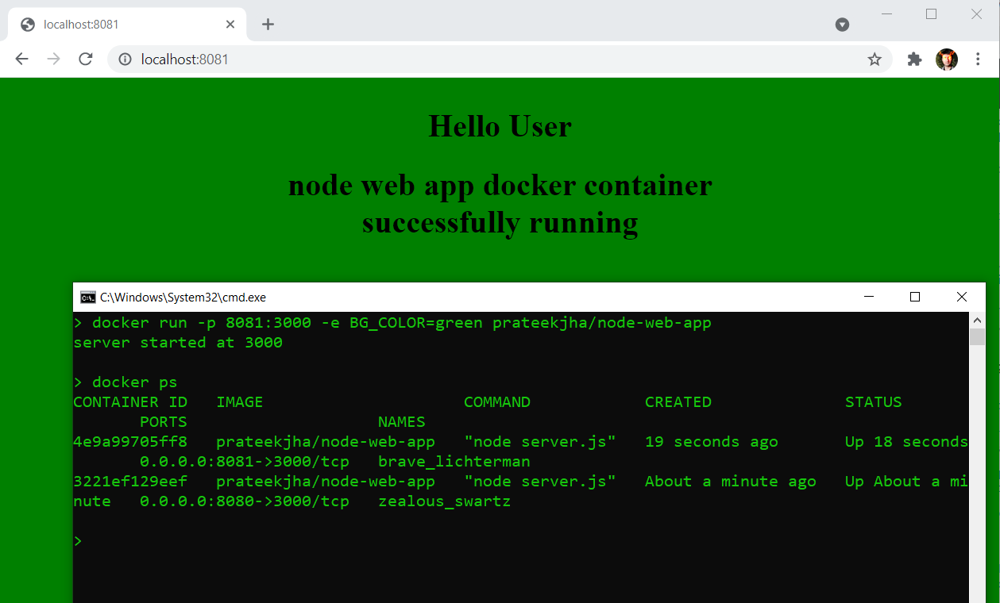

# Docker-custom-web-app
This is a custom node web app which is containerized using Docker and it takes bgcolor of web page as env variable and port mapping is also done to expose this container.

**Build** : To build own docker image using DOCKERFILE, run below custom command in same directory  
_docker build -t prateekjha/node-web-app ._

**Run** :
1. Yellow background color 
    
   _docker run -p 8080:3000 -e BG_COLOR=yellow prateekjha/node-web-app_
   
   Here external port mapped is 8080 and bgcolor of webapp is yellow

2. Green background color  
   _docker run -p 8081:3000 -e BG_COLOR=green prateekjha/node-web-app_
   
   Here external port mapped is 8081 and bgcolor of webapp is green
 

 
 **docker ps** lists all running containers and some additional info eg for how much time a container is up, command etc
